# LAND STACK — Database Architecture & ER Diagram

> **SIH 2026 Problem Statement SIH26014**  
> **Integrated GIS-based Digital Public Infrastructure for Land Governance**

---

## 1. Architectural Principle: The Parcel-Centric Data Model

In traditional governance, datasets are maintained in departmental silos with divergent identifiers. Land Stack unifies all records through **ULPIN** (Unique Land Parcel Identification Number) as the primary foreign anchor.

```mermaid
erDiagram
    PARCEL ||--o{ ROR : "has"
    PARCEL ||--o{ REGISTRATION : "registered_in"
    PARCEL ||--o{ PROPERTY_TAX : "assessed_for"
    PARCEL ||--o{ BUILDING_PERMISSION : "approved_for"
    PARCEL ||--o{ LAND_USE : "zoned_as"
    PARCEL ||--o{ ENCUMBRANCE : "pledged_in"
    PARCEL ||--o{ DISPUTE : "litigated_in"
    PARCEL ||--o{ RESTRICTION : "constrained_by"
    PARCEL ||--o{ SERVICE_REQUEST : "requested_on"

    OWNER ||--o{ ROR : "holds"
    USER ||--o{ SERVICE_REQUEST : "submits"
    USER ||--o{ AUDIT_LOG : "triggers"
    DEPARTMENT ||--o{ USER : "employs"
    SERVICE_REQUEST ||--o{ WORKFLOW_EVENT : "logs"

    PARCEL {
        int id PK
        string ulpin UK "TN-SAMPLE-XXXXXX"
        string survey_number
        string subdivision_number
        string village_code
        string village_name
        string taluk
        string district
        string state
        float area "acres"
        string land_use
        geometry geometry "POLYGON (EPSG:4326)"
        enum verification_status "UNVERIFIED, PENDING, VERIFIED, FLAGGED, CONFLICT"
        datetime created_at
        datetime updated_at
    }

    OWNER {
        int id PK
        string owner_reference UK
        string name
        string masked_identifier "Aadhaar/PAN (XXXX-XXXX-1234)"
        string ownership_type "Individual, Joint, Corporate"
    }

    ROR {
        int id PK
        string ulpin FK
        int owner_id FK
        string ownership_type
        float share_percentage
        string record_status
        datetime updated_at
    }

    REGISTRATION {
        int id PK
        string ulpin FK
        string registration_number UK
        string transaction_type "Sale Deed, Gift, Partition"
        datetime transaction_date
        string status
        string department_reference
    }

    PROPERTY_TAX {
        int id PK
        string ulpin FK
        string assessment_number
        string financial_year "2025-2026"
        float tax_amount
        float paid_amount
        float due_amount
        string status "PAID, PENDING, OVERDUE"
    }

    BUILDING_PERMISSION {
        int id PK
        string ulpin FK
        string approval_number
        string building_type "Residential, Commercial, Industrial"
        int number_of_floors
        datetime approval_date
        string status "APPROVED, REJECTED, EXPIRED"
    }

    LAND_USE {
        int id PK
        string ulpin FK
        string zoning "Primary Residential, Mixed Commercial, Agricultural"
        string permitted_use
        string restriction
        datetime effective_date
    }

    ENCUMBRANCE {
        int id PK
        string ulpin FK
        string type "Bank Mortgage, Lien, Court Attachment"
        string institution "SBI, HDFC, Canara Bank"
        float amount
        datetime start_date
        datetime end_date
        string status "ACTIVE, RELEASED"
    }

    DISPUTE {
        int id PK
        string ulpin FK
        string case_number
        string dispute_type "Boundary Dispute, Title Suit, Succession"
        datetime filing_date
        string status "PENDING, DISPOSED, STAYED"
    }

    RESTRICTION {
        int id PK
        string ulpin FK
        string restriction_type "CRZ, Waterbody Buffer, Archaeological, Forest"
        string description
        string status "ACTIVE, LIFTED"
    }

    SERVICE_REQUEST {
        int id PK
        string ulpin FK
        int citizen_id FK
        string service_type "Verification, Mutation, Demarcation"
        string description
        enum status "SUBMITTED, UNDER_REVIEW, DEPARTMENT_VERIFICATION, APPROVED, REJECTED, COMPLETED"
        string assigned_department
        int assigned_officer FK
        datetime created_at
        datetime updated_at
    }

    WORKFLOW_EVENT {
        int id PK
        int service_request_id FK
        string department
        string action
        string status
        string performed_by
        datetime timestamp
    }

    USERS {
        int id PK
        string name
        string email UK
        string phone
        string password_hash
        enum role "CITIZEN, OFFICER, ADMIN"
        int department_id FK
        string status
        datetime created_at
    }

    DEPARTMENTS {
        int id PK
        string name UK
        string department_code UK
        string description
    }

    AUDIT_LOGS {
        int id PK
        int user_id FK
        string action
        string entity_type
        string entity_id
        text old_value
        text new_value
        datetime timestamp
        string ip_reference
    }
```



---

## 2. Spatial Indexing & Performance Strategy

1. **GiST Spatial Index on `parcels.geometry`**:
   ```sql
   CREATE INDEX idx_parcels_geometry ON parcels USING GIST (geometry);
   ```
   Enables sub-millisecond bounding box intersection queries (`ST_Intersects`, `ST_Contains`, `ST_DWithin`) across thousands of parcels during map pan and zoom.

2. **ULPIN B-Tree Indexes**:
   Every department table references `parcels.ulpin` with an index, enabling O(log N) aggregation when fetching the unified Land Stack profile.

3. **Composite Text & Trigram Indexes**:
   ```sql
   CREATE INDEX idx_parcels_search ON parcels (village_code, survey_number);
   ```
